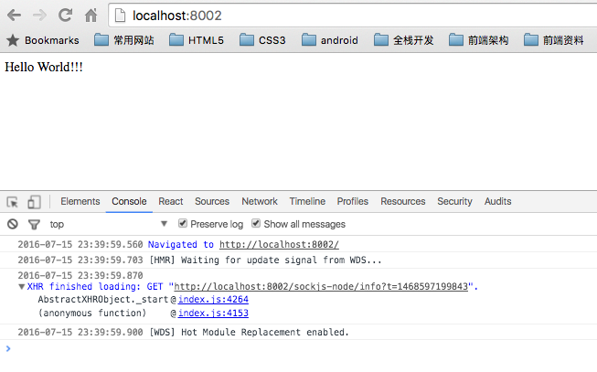

###React 安装

React 可以直接下载使用，下载包中也提供了很多学习的实例。

本教程使用了 React 的版本为 0.14.7，你可以在官网 http://facebook.github.io/react/ 下载最新版。

你也可以直接使用菜鸟教程的 React CDN 库，地址如下：
```
<script src="http://static.runoob.com/assets/react/react-0.14.7/build/react.min.js"></script>
<script src="http://static.runoob.com/assets/react/react-0.14.7/build/react-dom.min.js"></script>
<script src="http://static.runoob.com/assets/react/browser.min.js"></script>
```
使用实例
以下实例输出了 Hello, world!
```
<!DOCTYPE html>
<html>
  <head>
    <meta charset="UTF-8" />
    <title>Hello React!</title>
    <script src="http://static.runoob.com/assets/react/react-0.14.7/build/react.min.js"></script>
    <script src="http://static.runoob.com/assets/react/react-0.14.7/build/react-dom.min.js"></script>
    <script src="http://static.runoob.com/assets/react/browser.min.js"></script>
  </head>
  <body>
    <div id="example"></div>
    <script type="text/babel">
      ReactDOM.render(
        <h1>Hello, world!</h1>,
        document.getElementById('example')
      );
    </script>
  </body>
</html>
```
实例解析：
实例中我们引入了三个库： react.min.js 、react-dom.min.js 和 browser.min.js：
*react.min.js - React 的核心库
*react-dom.min.js - 提供与 DOM 相关的功能
*browser.min.js - 用于将 JSX 语法转为 JavaScript 语法
```
ReactDOM.render(
	<h1>Hello, world!</h1>,
	document.getElementById('example')
);
```
以上代码将一个 h1 标题，插入 id="example" 节点中。

注意：

如果我们需要使用JSX则```<script>```标签的type属性需要设置为 text/babel。

通过 npm 使用 React

如果你的系统还不支持 Node.js 及 NPM 可以参考我们的 [Node.js 教程](http://www.runoob.com/nodejs/nodejs-tutorial.html)。

我们建议在 React 中使用 CommonJS 模块系统，比如 browserify 或 webpack，本教程使用 webpack。

第一步、安装全局包
```
$ npm install babel -g
$ npm install webpack -g
$ npm install webpack-dev-server -g
```
第二步、创建根目录

创建一个根目录，目录名为：reactApp，再使用 npm init 初始化，生成 package.json 文件：
```
$ mkdir reactApp
$ cd reactApp/
$ npm init
```

```
name: (reactApp) runoob-react-test
version: (1.0.0)
description: react test
entry point: (index.js)
test command:
git repository:
keywords:
author:
license: (ISC)
About to write to /Users/tianqixin/www/reactApp/package.json:

{
  "name": "runoob-react-test",
  "version": "1.0.0",
  "description": "react test",
  "main": "index.js",
  "scripts": {
    "test": "echo \"Error: no test specified\" && exit 1"
  },
  "author": "",
  "license": "ISC"
}


Is this ok? (yes)
```

第三步、添加依赖包及插件

因为我们要使用 React, 所以我们需要先安装它，--save 命令用于将包添加至 package.json 文件。
```
$ npm install react --save
$ npm install react-dom --save
```
同时我们也要安装一些 babel 插件
```
$ npm install babel-core
$ npm install babel-loader
$ npm install babel-preset-react
$ npm install babel-preset-es2015
```
第四步、创建文件

接下来我们创建一些必要文件：
```
$ touch index.html
$ touch App.jsx
$ touch main.js
$ touch webpack.config.js
```
第五步、设置编译器，服务器，

打开 webpack.config.js 文件添加以下代码:
```
 var config = {
   entry: './main.js',

   output: {
      path:'./',
      filename: 'index.js',
   },

   devServer: {
      inline: true,
      port: 8002
   },

   module: {
      loaders: [ {
         test: /\.jsx?$/,
         exclude: /node_modules/,
         loader: 'babel',

         query: {
            presets: ['es2015', 'react']
         }
      }]
   }

}

module.exports = config;
```

entry: 指定打包的入口文件 main.js。
output：配置打包结果，path定义了输出的文件夹，filename则定义了打包结果文件的名称。
devServer：设置服务器端口号为 7777，端口后你可以自己设定 。
module：定义了对模块的处理逻辑，这里可以用loaders定义了一系列的加载器，以及一些正则。当需要加载的文件匹配test的正则时，就会调用后面的loader对文件进行处理，这正是webpack强大的原因。

现在打开 package.json 文件，找到 "scripts" 中的 "test" "echo \"Error: no test specified\" && exit 1" 使用以下代码替换：
```
"start": "webpack-dev-server --hot"
```
替换后的 package.json 文件 内容如下：
```
$ cat package.json
{
  "name": "02-react-install",
  "version": "1.0.0",
  "description": "react install",
  "main": "bundle.js",
  "scripts": {
    "start": "webpack-dev-server --hot"
  },
  "author": "scott",
  "license": "MIT",
  "dependencies": {
    "babel-core": "^6.10.4",
    "babel-loader": "^6.2.4",
    "babel-preset-es2015": "^6.9.0",
    "babel-preset-react": "^6.11.1",
    "react": "^15.2.1",
    "react-dom": "^15.2.1",
    "webpack": "^1.13.1"
  }
}

```

现在我们可以使用 npm start 命令来启动服务。

--hot 命令会在文件变化后重新载入，这样我们就不需要在代码修改后重新刷新浏览器就能看到变化。

第六步、index.html

设置 div id = "app" 为我们应用的根元素，并引入 index.js 脚本文件。
```
<!DOCTYPE html>
<html>

   <head>
      <meta charset = "UTF-8">
      <title>React App</title>
   </head>

   <body>
      <div id = "app"></div>
      <script src = "index.js"></script>
   </body>

</html>
```

第七步、App.jsx 和 main.js

这是第一个 react 组件。后面的章节我们会详细介绍 React 组件。这个组件将输出 Hello World!!!。

App.jsx 文件代码
```
import React from 'react';

class App extends React.Component {
   render() {
      return (
         <div>
            Hello World!!!<br />
         </div>
      );
   }
}

export default App;
```

我们需要引入组件并将其渲染到根元素 App 上，这样我们才可以在浏览器上看到它。

main.js 文件代码
```
import React from 'react';
import ReactDOM from 'react-dom';

import App from './App.jsx';

ReactDOM.render(<App />, document.getElementById('app'))
```

注意：

如果想要组件可以在任何的应用中使用，需要在创建后使用 export 将其导出，在使用组件的文件使用 import 将其导入。

第八步、运行服务

完成以上配置后，我们即可运行该服务：
```
$ npm start
```

通过浏览器访问 http://localhost:8002/，输出结果如下：

